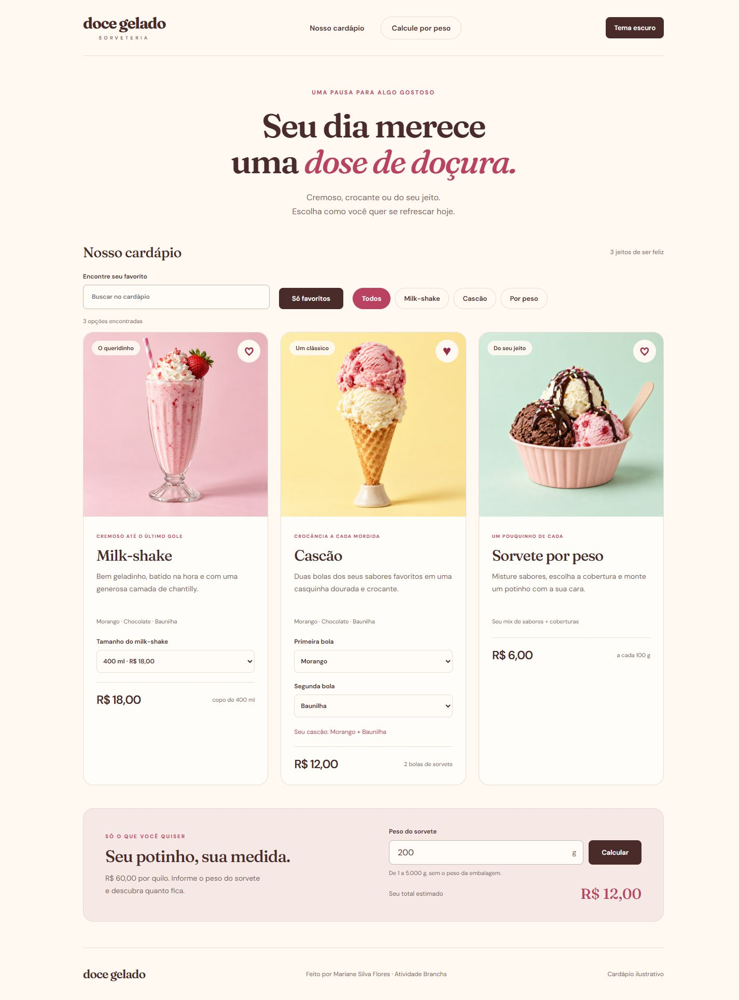
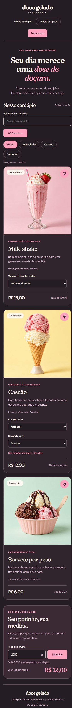

# Doce Gelado — Atividade Branchs

Cardápio interativo desenvolvido com HTML, CSS e JavaScript por Mariane Silva Flores.

Base: [sorveteria-cardapio](https://github.com/marianesilvaflores/sorveteria-cardapio). As três imagens foram geradas com IA da OpenAI para o projeto original. Preços e produtos ilustrativos.

## Executar
Abra index.html no navegador ou use um servidor estático local. Não há dependências de instalação.

## Organização
Seis funcionalidades em branches feature/nome-da-funcionalidade, com pelo menos dois commits por branch. Três integrações diretas e três por pull request, todas na master.

A busca ignora acentos e maiúsculas e funciona junto com as categorias. O contador avisa quando nenhum produto corresponde aos filtros.

O milk-shake oferece 300 ml (R$ 14), 400 ml (R$ 18) e 500 ml (R$ 22). O preço é atualizado ao escolher o tamanho.

Escolha os sabores de cada uma das duas bolas do cascão. É possível repetir sabores; o resumo muda imediatamente e o preço permanece R$ 12,00.

Favoritos e tema são salvos apenas neste navegador. Se o armazenamento estiver bloqueado, os controles continuam funcionando durante a visita. Nenhum pedido é enviado e nenhum pagamento é realizado.

## Acessar

- [Ver o cardápio publicado](https://marianesilvaflores.github.io/atividade-branchs/)
- [Repositório](https://github.com/marianesilvaflores/atividade-branchs)

## Funcionalidades e integrações

Cada branch abaixo contém **dois commits próprios**, além dos commits herdados da master. As branches foram preservadas para consulta. As integrações diretas usam merge com registro próprio; os pull requests foram integrados pelo GitHub.

| Funcionalidade | Branch | Integração na master |
| --- | --- | --- |
| Filtro por categoria | `feature/filtro-categorias` | Merge direto |
| Busca por nome | `feature/busca-produtos` | Merge direto |
| Tamanho e preço do milk-shake | `feature/tamanhos-milkshake` | Merge direto |
| Sabores das duas bolas do cascão | `feature/sabores-cascao` | [PR #1](https://github.com/marianesilvaflores/atividade-branchs/pull/1) |
| Favoritos com persistência | `feature/favoritos` | [PR #2](https://github.com/marianesilvaflores/atividade-branchs/pull/2) |
| Tema claro e escuro | `feature/tema-claro-escuro` | [PR #3](https://github.com/marianesilvaflores/atividade-branchs/pull/3) |

## Verificação

Testes manuais realizados no navegador:

- Busca por `CASCAO` encontra Cascão; combinar com Milk-shake retorna o aviso de nenhum resultado.
- Selecionar 500 ml atualiza o preço para R$ 22,00.
- Escolher Chocolate nas duas bolas atualiza o resumo e mantém o preço do cascão.
- Favoritar Cascão e ativar Só favoritos exibe apenas esse produto.
- Recarregar preserva favoritos e tema.
- Calculadora: 250 g retorna R$ 15,00; 0 g exibe erro de validação.
- Layout conferido em desktop e celular, sem rolagem horizontal.
- JavaScript validado com `node --check script.js`.

## Imagens da aplicação

### Desktop

### Celular com tema escuro

## Tecnologias e autoria

HTML5, CSS3, JavaScript, Git, GitHub e GitHub Pages. Fontes DM Sans e Fraunces via Google Fonts. Projeto acadêmico de **Mariane Silva Flores**, desenvolvido com apoio de IA.
